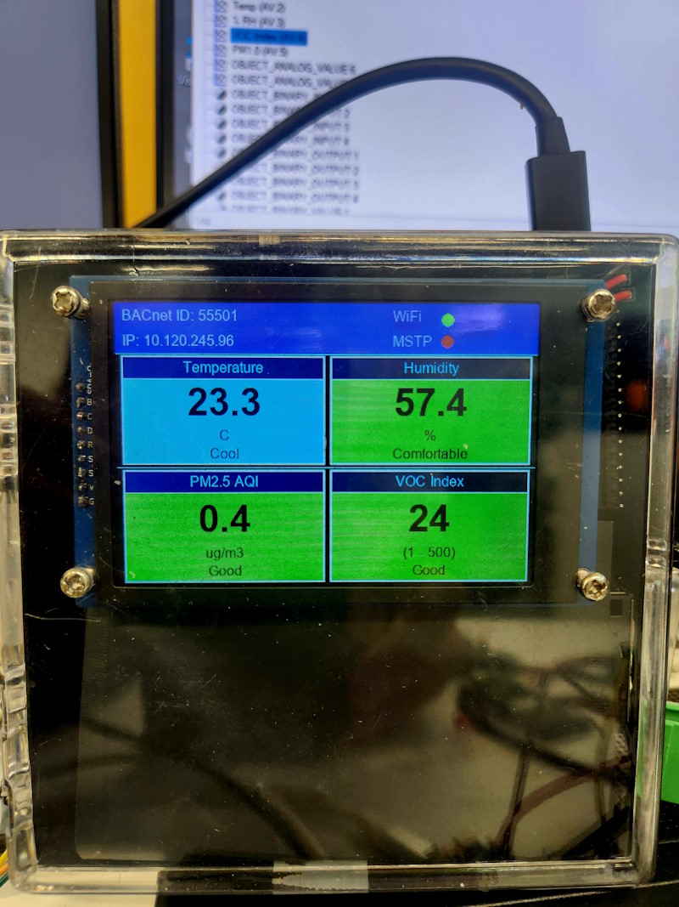

# ESP32-S3 BACnet Air Quality Sensor Display

ESP32-S3 BACnet device with a 320 × 480 ST7796S TFT display, SEN54 air-quality sensing, DS18B20 temperature sensing, 
BACnet/IP over Wi-Fi, and optional BACnet MS/TP over RS485.

The application is organized into `main/app`, `main/bacnet`, `main/platform`, and `main/ui`. 
BACnet object defaults and instance mappings are centralized in `main/User_Settings.c`, 
while private Wi-Fi credentials are stored separately in `main/User_Private_Settings.h` and excluded from source control.

## Features

- 36 BACnet application objects:
  - 16 Analog Values (`AV`)
  - 4 Binary Values (`BV`)
  - 8 Analog Inputs (`AI`)
  - 4 Binary Inputs (`BI`)
  - 4 Binary Outputs (`BO`)
- BACnet/IP over ESP32 Wi-Fi
- Optional BACnet MS/TP over RS485
- ST7796S display driven by `TFT_eSPI`
- SEN54 and DS18B20 sensor integration
- Configurable BACnet object instance arrays
- NVS persistence for supported writable BACnet properties
- Private Wi-Fi credentials kept outside tracked source files
- Modular application, BACnet, platform, sensor, and display code

## Source Layout

### `main/main.c`

Application entry point and startup orchestration. It initializes:

- NVS and persistence policy
- Stack profiling
- BACnet runtime
- Display hardware
- Sensor acquisition
- Application supervisor loop

### `main/app/`

Application-level services:

- `app_storage.c`: NVS initialization and default-override policy
- `app_supervisor.c`: periodic display, link-status, BACnet maintenance, and diagnostic processing
- `sensor_service.c`: SEN54 and DS18B20 acquisition and BACnet AI updates
- `stack_profiler.c`: FreeRTOS task stack monitoring

### `main/bacnet/`

BACnet application runtime:

- BACnet/IP and MS/TP initialization
- Receive and dispatcher tasks
- BACnet coordinator and event bus
- Service-handler registration
- Application object creation

### `main/bacnet/objects/`

Project BACnet object implementations for:

- Analog Input
- Analog Value
- Binary Input
- Binary Output
- Binary Value

These modules also provide NVS loading and saving for supported object properties.

### `main/platform/`

Hardware and networking support:

- Wi-Fi station initialization
- BACnet MS/TP RS485 interface

### `main/ui/`

Display implementation and fonts.

### `main/User_Settings.h` and `main/User_Settings.c`

Central project configuration, including:

- Object counts
- BACnet instance arrays
- Object names and descriptions
- Engineering units
- Initial values
- COV increments
- BACnet transport settings
- Device identity
- Static IP and BBMD settings

### `main/User_Private_Settings.example.h`

Template for the private Wi-Fi credentials file.

Copy it to:

```text
main/User_Private_Settings.h
```

The real private settings file is excluded from Git.

## BACnet Object Model

Object counts are defined in `main/User_Settings.h`:

```c
USER_AV_COUNT = 16
USER_BV_COUNT = 4
USER_AI_COUNT = 8
USER_BI_COUNT = 4
USER_BO_COUNT = 4
```

The exposed BACnet instance numbers come from configurable arrays in `main/User_Settings.c`:

```c
USER_AV_INSTANCES[]
USER_BV_INSTANCES[]
USER_AI_INSTANCES[]
USER_BI_INSTANCES[]
USER_BO_INSTANCES[]
```

This allows the BACnet instance numbers to be changed centrally without changing the corresponding application and sensor logic.

Names, descriptions, units, initial values, and COV increments are also defined through parallel configuration arrays in `User_Settings.c`.

## Sensor Mapping

The sensor service in `main/app/sensor_service.c` uses logical positions in the configured Analog Input array.

The default mapping is:

| Default object | Measurement |
|---|---|
| AI1 | SEN54 temperature |
| AI2 | SEN54 relative humidity |
| AI3 | SEN54 VOC index |
| AI4 | SEN54 PM1.0 |
| AI5 | SEN54 PM2.5 |
| AI6 | SEN54 PM4.0 |
| AI7 | SEN54 PM10 |
| AI8 | DS18B20 temperature |

The first configured Binary Value is used as the SEN54 reset command:

| Default object | Function |
|---|---|
| BV1 | SEN54 full reset |

These are logical default mappings. The actual BACnet instance numbers are obtained from `USER_AI_INSTANCES[]` and `USER_BV_INSTANCES[]`.

## Display

The display implementation uses `TFT_eSPI`.

- Display code: `main/ui/display.cpp`
- TFT setup: `components/TFT_eSPI/User_Setup.h`
- Driver: `ST7796_DRIVER`
- Native panel size: 320 × 480
- Runtime orientation: 480 × 320

### TFT pin mapping

| Signal | GPIO |
|---|---:|
| MOSI | 10 |
| SCLK | 9 |
| CS | 13 |
| DC | 12 |
| RST | 11 |
| Backlight | 14 |

The display reads selected live values from the BACnet Analog Input objects. The complete 36-object model remains available to BACnet clients.

## Persistence and Defaults

Supported BACnet object properties are persisted in NVS by the modules under `main/bacnet/objects/`.

Persistence policy is controlled by `main/app/app_storage.c` and:

```c
USER_OVERRIDE_NVS_ON_FLASH
```

in `main/User_Settings.c`.

### Normal operation

```c
USER_OVERRIDE_NVS_ON_FLASH = 0
```

Previously saved NVS values are restored during startup.

### Restore compiled defaults

```c
USER_OVERRIDE_NVS_ON_FLASH = 1
```

NVS is erased during startup and the compiled defaults from `User_Settings.c` are applied.

After restoring defaults, set the option back to `0` and flash the firmware again. Leaving it at `1` erases NVS on every boot.

Depending on the object type, persisted properties may include:

- Object Name
- Description
- Present Value
- Engineering Units
- COV Increment
- Active Text and Inactive Text

See `OBJECTS_CONFIGURATION.md` for property-specific details.

## Wi-Fi Configuration

Tracked network defaults are stored in `main/User_Settings.c`, but private Wi-Fi credentials are not committed.

To configure Wi-Fi:

1. Copy:

   ```text
   main/User_Private_Settings.example.h
   ```

   to:

   ```text
   main/User_Private_Settings.h
   ```

2. Set:

   ```c
   USER_WIFI_SSID
   USER_WIFI_PASS
   ```

3. Adjust the static IP configuration in `main/User_Settings.c` when required.

## BACnet Transport Configuration

BACnet transport settings in `main/User_Settings.c` include:

```c
USER_ENABLE_BACNET_IP
USER_ENABLE_BACNET_MSTP
USER_MSTP_MAC_ADDRESS
USER_MSTP_MAX_INFO_FRAMES
USER_MSTP_MAX_MASTER
USER_MSTP_BAUD_RATE
```

The file also contains:

- BACnet device name
- BACnet device instance
- Static IP settings
- BBMD address and port
- Foreign Device Registration settings

BACnet/IP is enabled by default. BACnet MS/TP support is optional and can be enabled when the RS485 hardware and pin configuration are ready.

## Build Requirements

- Windows 10 or Windows 11
- Visual Studio Code
- Espressif ESP-IDF extension
- ESP-IDF `v5.5.4`
- ESP32-S3 target
- Arduino-ESP32 `3.3.10`
- Git

Expected ESP-IDF installation:

```text
C:\esp\v5.5.4\esp-idf
```

## Build with Visual Studio Code

1. Open the repository in VS Code.
2. Configure the ESP-IDF extension for ESP-IDF `v5.5.4`.
3. Select the `esp32s3` target.
4. Select the correct serial port.
5. Use the ESP-IDF status-bar commands to build, flash, and monitor the device.

## Build with the Repository Script

```powershell
powershell -NoProfile -ExecutionPolicy Bypass `
    -File .\tools\build_idf55.ps1 build
```

## Build from an ESP-IDF PowerShell

Initialize the ESP-IDF environment:

```powershell
& C:\esp\v5.5.4\esp-idf\export.ps1
```

Then run:

```powershell
idf.py build
idf.py -p COM11 flash
idf.py -p COM11 monitor
```

Replace `COM11` with the serial port used by the board.

See `SETUP.md` for the complete setup procedure.

## Hardware Summary

- ESP32-S3
- ST7796S SPI TFT display
- SEN54 air-quality sensor over I2C
  - SDA: GPIO4
  - SCL: GPIO5
- DS18B20 temperature sensor
  - Data: GPIO18
- Optional RS485 transceiver for BACnet MS/TP

## Testing

The BACnet device can be tested using YABE or another BACnet client.

Recommended checks:

- BACnet device discovery
- Complete Object List
- Object Name and Description reads
- AI1–AI8 sensor updates
- AV, BV, and BO writes
- Units and COV Increment writes
- NVS persistence after restart
- COV subscriptions
- Display updates
- Wi-Fi link indication

## Photos

### SEN54 sensor and display



### BACnet objects in YABE


## Additional Documentation

- `SETUP.md`: environment setup, building, flashing, and monitoring
- `OBJECTS_CONFIGURATION.md`: BACnet object configuration and persistence
